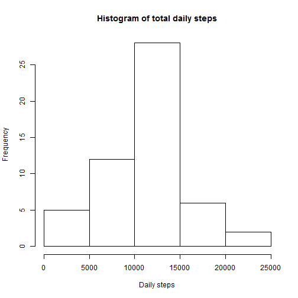
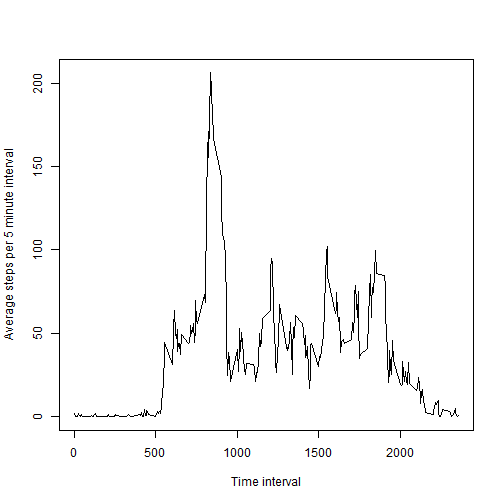
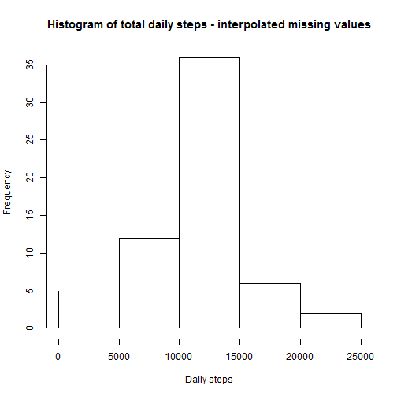
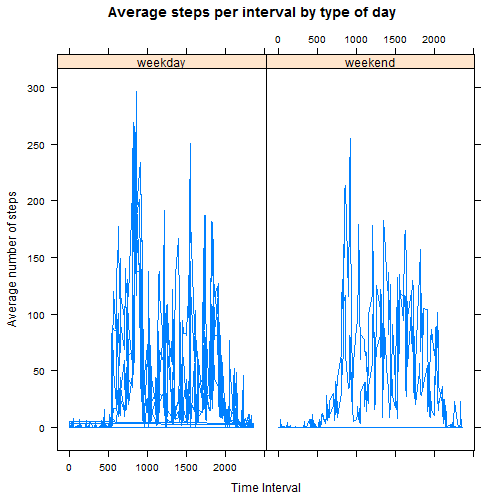

# Reproducible Research: Peer Assessment 1


## Loading and preprocessing the data

```r
activity <- read.csv("~/Reproducible Research/activity.csv")
activity$date <- as.Date(activity$date, "%Y-%m-%d")
```


## What is mean total number of steps taken per day?
The approach taken to computing this is to make a table of the total number of steps taken per day and store it in a variable "a". We then compute the mean of "a", taking care to ensure that the missing values are removed.


```r
a <- tapply(activity$steps, activity$date, FUN = sum)
par(mfrow = c(1, 1))
hist(a, main = "Histogram of total daily steps", xlab = "Daily steps")
```

 

```r
m1 <- mean(a, na.rm = T)
m2 <- median(a, na.rm = T)
message("The mean is ", m1, " and the median is ", m2)
```

```
## The mean is 10766.1886792453 and the median is 10765
```


## What is the average daily activity pattern?
Here's a graph of the daily activity pattern. A spike is clearly visible in the morning, and there are other subsidiary peaks later on in the day. The period of very low activity presumably corresponds to the time the subjects are usually asleep.
The code below plots a line graph of the mean number of steps by time. It also identifies and prints out the time interval associated with the greatest activity.

```r
meanStepsByTime <- tapply(activity$steps, activity$interval, mean, na.rm = T)
plot(names(meanStepsByTime), meanStepsByTime, "l", xlab = "Time interval", ylab = "Average steps per 5 minute interval")
```

 

```r
# Pick out the entry with the maximum average number of steps. If we just
# need the interval, we need the # name
a <- names(meanStepsByTime[meanStepsByTime == max(meanStepsByTime)])
message("The interval with maximum average steps is ", a)
```

```
## The interval with maximum average steps is 835
```


## Imputing missing values
The code below calculates and reports the total number of missing values. For the given data set, the only missing values are in the sets column, but the code does the computation by calculating the number of rows with any missing element, and so should generalise to other cases. 

The strategy to fill in the missing values is to replace the missing value by the average across all days for that particular time interval. So for example if the steps value for the interval 15 is missing on an particular day, it is replaced by the average of steps taken for the 15 interval on all days.


```r
# Find the rows with any missing values
m <- apply(activity, 1, function(x) sum(is.na(x)) > 0)
n <- sum(m)
message("The number of rows missing data is ", n)
```

```
## The number of rows missing data is 2304
```

```r
completeData <- activity
completeData[m > 0, "steps"] <- meanStepsByTime[as.character(completeData[m > 
    0, "interval"])]
a <- tapply(completeData$steps, completeData$date, FUN = sum)
par(mfrow = c(1, 1))
hist(a, main = "Histogram of total daily steps - interpolated missing values", 
    xlab = "Daily steps")
```

 

```r
m1 <- mean(a, na.rm = T)
m2 <- median(a, na.rm = T)
message("The new mean is ", m1, " and the new median is ", m2)
```

```
## The new mean is 10766.1886792453 and the new median is 10766.1886792453
```

You can see that the mean does not change (because of the strategy we've used to fill in the data), but the median changes by a tiny amount.


## Are there differences in activity patterns between weekdays and weekends?

```r
completeData$dayType <- weekdays(activity$date)
completeData$dayType <- factor(completeData$dayType, levels = c("Monday", "Tuesday", 
    "Wednesday", "Thursday", "Friday", "Saturday", "Sunday"), labels = c("weekday", 
    "weekday", "weekday", "weekday", "weekday", "weekend", "weekend"))
```

```
## Warning: duplicated levels in factors are deprecated
```

```r
library(lattice)
## Use aggregate function to calculate the mean for a particular interval
## broken down by dayType
temp1 <- aggregate(steps ~ interval + dayType, completeData, mean)
xyplot(temp1$steps ~ temp1$interval | temp1$dayType, type = "l", xlab = "Time Interval", 
    ylab = "Average number of steps", main = "Average steps per interval by type of day")
```

```
## Warning: duplicated levels in factors are deprecated
```

 

The weekend plots show lower mean steps taken per 5 minute interval. As you would expect the activity also starts later in the day, perhaps corresponding to people waking up later.
